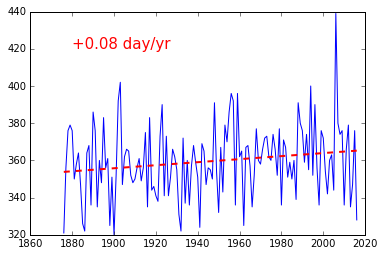

# Day of First Snow @ Tokyo

```python
%matplotlib inline
from pylab import *
from datetime import datetime
import re
```


```python
sdates = [map(int, re.findall('\d+', s)) for s in open('./Snow@Tokyo.csv').readlines()[1:]]
```


```python
sdates.append([2016,11,24])
```


```python
doys = [(datetime(y+1 if m<6 else y,m,d)-datetime(y,1,1)).days for y,m,d in sdates]
```


```python
yrs = zip(*sdates)[0]
```


```python
a,b = polyfit( yrs, doys, 1)
```


```python
plot( yrs, doys)
plot( yrs, [a*yr+b for yr in yrs], 'r--', lw=2 )
text( 1880,420, '%+.2f day/yr'%a, color='r', fontsize=15)
```


    <matplotlib.text.Text at 0x74e19b0>





```python

```
